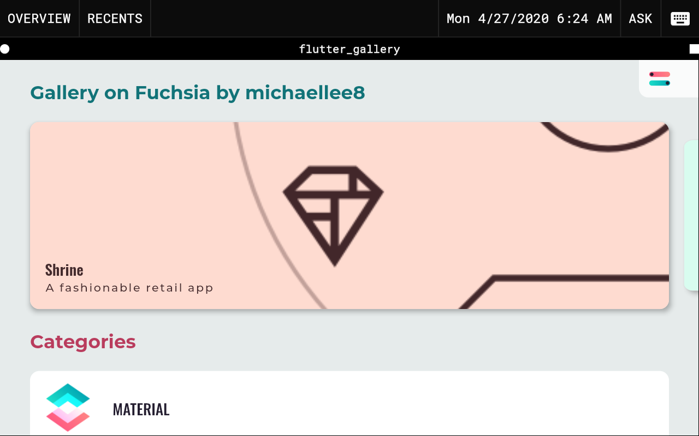

# Flutter SDK setup for developing with Fuchsia SDK

This project aims to provide guidance to developing Flutter applications for
Fuchsia using the Fuchsia GN C++ SDK. It does not require downloading and 
building Fuchsia locally, which is enromusly big.

Disclaimer: This project have no relation with Google. This is unofficial. 
Use this at your own risk!

Those scripts are tested to work in Ubuntu 18.04 LTS.

## Required patches

Before https://github.com/flutter/flutter/pull/84759 is merged, one will need 
the modification in https://github.com/michaellee8/flutter/tree/fix/fuchsia-pm-serve 
to use `flutter run` properly.

## Features

- Running Fuchsia in emulator/on device without cloning and compiling the whole source tree using Google's Fuchsia SDK.
- Can run Flutter apps with hot-reload enabled, and build a release package and then push it into Fuchsia as well.
- Wrapped into one single command flutterfx to call all these tools.

## Video tutorial
https://youtu.be/gxV8EN9vzbc
- Remember to do `export FUCHSIA_SSH_CONFIG=$HOME/.fuchsia/sshconfig` before running flutter run in any shell, I didn't do that in the video since I have it in my .bashrc .
- Also I forgot to mention that any new Flutter project will require a cmx file to be able to run/bulild on Fuchsia, an example can be found at https://github.com/michaellee8/flutter_gallery/blob/master/fuchsia/meta/flutter_gallery.cmx
- Manually aplying the patch should be no longer required now since my PR has already been accepted.

## Expected Result



## Command usage
```
usage: flutterfx

    bootstrap: init submodule and download required artifacts
    update: update this repo and submodules
    fuchsia <fserve|fpave|fserve-remote|fdevtools|fssh|fcp|femu|fpublish|fconfig|femu-exec-wrapper>: run <command> in the fuchsia sdk
    flutter <command>: run <command> in the flutter sdk
    readme: show the readme file
    help: display this message
```

## Prerequisites
The below commands reflect the libraries and utilities you have to install before you can get started. 
However these command will probably differ depending on your OS and distro. 

```sh
sudo apt-get install curl unzip python2 \
libglu1-mesa bash curl git unzip xz-utils zip \
libvulkan1 mesa-vulkan-drivers
```

## Setting up for flutter run (working now)
It is verified that hot reload iw working as well. Use it by pressing r 
in the terminal after launching the flutter app with flutter run.
```sh
git clone http://github.com/michaellee8/flutter_fuchsia_toolchain --recurse-submodules --recursive  --depth 1 --shallow-submodule --remote-submodules
# Assumes you have added ./bin to your path, if you haven't, use ./bin/flutterfx instead of flutterfx
# You need to apply my patch at https://github.com/flutter/flutter/pull/55664/files before it is merged
flutterfx bootstrap
flutterfx flutter config --enable-fuchsia
flutterfx bootstrap
sudo ip tuntap add dev qemu mode tap user $USER && sudo ip link set qemu up
flutterfx fuchsia femu -N --image qemu-x64
flutterfx fuchsia fserve --image qemu-x64
cd flutter_gallery # See Note 4
export FUCHSIA_SSH_CONFIG=$HOME/.fuchsia/sshconfig # See Note 2
flutterfx flutter run --verbose -d <flutter device name from flutterfx flutter devices>
```

## So how do I actually run my Flutter app in Fuchsia (using flutter build on workstation flavor here)

Okay, I know why you are here. There are a lot of quirks here. ~~`flutter run` after applying my 
patch still breaks because of some `rust tuf` I/O error~~ (working now) (you can see it with log_listener). Also 
for some reason it is not possible to launch a package via tiles_ctl or sessionctl on the emulator 
and the ermine (the desktop environment you see in the workstation flavour) will not load any 
package name that is not present in the original package repo. So my hack is to force updating 
the `flutter_gallery` package and then launch it from ermine. You can do further work by changing my 
`flutter_gallery` checkout. 

The command below assumes that you start from scratch, on a Linux environment (I use Ubuntu 18.04 LTS). 
You are advised to follow it strictly. You may want to mess around yourself later through but this 
is the only way that is verified to work. Prepare a great internet connection or wait for hours.

Note that (term1) (term2) (term3) ... means different terminal. You will need a few of them.

```sh
cd ~
git clone https://github.com/michaellee8/flutter_fuchsia_toolchain.git --recursive
git clone https://github.com/michaellee8/flutter_gallery.git
# install ~/flutter_fuchsia_toolchain/bin to your path
# Before my PR being merged, you will need to apply the patch in
# https://github.com/flutter/flutter/pull/55715 to ./flutter
flutterfx bootstrap
sudo ip tuntap add dev qemu mode tap user $USER && sudo ip link set qemu up
(term1) cd flutter_gallery
(term1) flutterfx flutter pub get
(term1) flutterfx flutter build fuchsia --release --runner-source fuchsia.com \
  --tree-shake-icons  --verbose --target-platform fuchsia-x64 
(term2) flutterfx fuchsia femu -N --image workstation.qemu-x64-release
(term3) flutterfx fuchsia fserve --image workstation.qemu-x64-release
(term1) flutterfx fuchsia fpublish ./build/fuchsia/pkg/flutter_gallery-0.far
(term1) cd "$(flutterfx dir)/flutter/bin/cache/artifacts/flutter_runner/flutter/x64/release" && \
            flutterfx fuchsia fpublish aot/flutter_aot_product_runner-0.far \
            aot/dart_aot_product_runner-0.far jit/flutter_jit_product_runner-0.far \
            aot/dart_jit_product_runner-0.far && cd ~/flutter_gallery
(term4) flutterfx fuchsia fssh log_listener
# in the ermine ui shell, type flutter_gallery and then press enter to launch it
# if you face Error while initializing the Dart VM: Wrong full snapshot version, expected
# you will need to do
# flutterfx flutter clean
# cd ~/flutter_fuchsia_toolchain/flutter/bin
# rm -rf ./cache
```


## Some notes
1. You may want to add `./flutter_fuchsia_toolchain/bin` to your PATH.
2. You will need `export FUCHSIA_SSH_CONFIG=$HOME/.fuchsia/sshconfig` to setup flutter's connection to the device.
3. Use `--verbose` for debugging.
4. You may want to look at my flutter gallery fork at https://github.com/michaellee8/flutter_gallery to look for 
fuchsia specific config.
5. A link on the full snapshot error (chinese) https://juejin.im/post/5d0dfd6f518825329840196d
6. Interestingly, `flutter run` only works on qemu-x64 image. Maybe it is because workstation does not have tiles.
7. If you don't to modify your path, you may also `cd` into repo root and do `alias flutterfx="$(pwd)/bin/flutterfx"`.
8. If you use shallow clone and ran into some flutter veriosn issues, either 
   follow the steps in https://github.com/flutter/flutter/wiki/Workarounds-for-common-issues#flutter-installation-corrupted 
   and then run `git pull --unshallow` on the flutter git repo 
   or just delete the version constriant in your flutter app's pubspec.yaml, the 
   former one should be considered as the more approiate solution but require 
   more download size.
9. Add `--software-gpu` to the `femu` command if you hit any Vulkan or Dart 
   Observatory issues. It is the mitigation for using Intel GPU on Linux.

## Known issues
1. Somehow the guest will not launch the installed packages currently, will be 
investigated. Currently a patch at https://github.com/flutter/flutter/pull/55664 adresses the ipv6 
issue, but some other bugs are being investigated.

## Emulator flavours
You should look at the values listed in here (or newer directories): 
https://console.cloud.google.com/storage/browser/fuchsia/development/5.20210616.2.1/images/?authuser=0  

- qemu-arm64
- qemu-x64
- workstation.qemu-x64-release (you probably want to use this default)

## Where are the files?
- This folder
- ~/.fuchsia

## Configuration
`config-common.sh`
- `USE_MODIFIED_FLUTTER`: If this is not set to empty, flutterfx will use dart toolchain to run all flutter commands 
which runs flutter from source. If it is empty, flutterfx will use the flutter command directly, which uses the faster snapshot 
method instead. It should be set to non-empty if you want to run a modified flutter toolchain.

## Quick commands
```sh
git clone https://github.com/michaellee8/flutter_fuchsia_toolchain.git --recursive
sudo ip tuntap add dev qemu mode tap user $USER && sudo ip link set qemu up
ifconfig qemu | grep inet6
flutterfx fuchsia femu -N --image workstation.qemu-x64-release
flutterfx fuchsia fserve --image workstation.qemu-x64-release
flutterfx fuchsia fpublish ~/gallery/build/fuchsia/pkg/gallery-0.far # if you are playing with flutter gallery
flutterfx flutter build fuchsia --release --verbose --runner-source fuchsia.com --tree-shake-icons
flutterfx flutter run -d <flutter device name from flutterfx flutter devices>
flutterfx fuchsia fssh log_listener --clock Local

# if fssh somehow won't work, use this instead
ssh -F /home/michaellee8/.fuchsia/sshconfig fe80::89ff:4714:d9a3:586c%qemu
```

## To uninstall/reinstall
**Make sure you know what you are doing before typing these commands!**
```sh
rm -rf $(flutterfx dir) # This command will get you the installation location of the toolchain 
# and delete it completely
rm -rf ~/flutter_gallery # If you cloned the flutter gallery there
rm -rf ~/.fuchsia # Default location of fuchsis sdk's image and package cache
```

## IDE Setup
You just need to set the Flutter SDK location of your IDE to `$(flutterfx dir)/flutter`, which should be `~/flutter_fuchsia_toolchain/flutter` if you followed the suggestions above.
